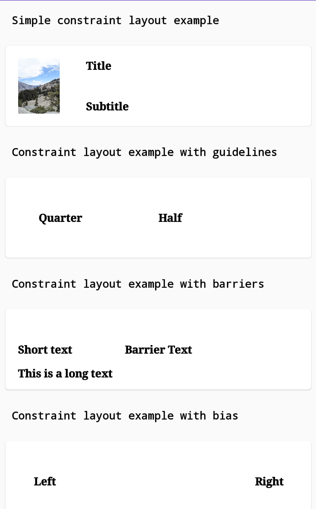

# Learn Jetpack Compose By Example 
  

Over the course of the last few years Android development has gone
through significant changes in how we structure our apps, the language
we use for development, the tooling & libraries that help us speed up
our development and the improvements in testing our apps. What had not
changed in all these years is the Android UI toolkit. This changes with
Jetpack Compose that aims to re-imagine what Android UI development
would look like using declarative programming principles. It is heavily
influenced by existing web and mobile frameworks such as React, Litho,
Vue & Flutter and would be a paradigm shift in Android UI development as
we know it.

This repository aims to show the Jetpack Compose way of building common
Android UI that we are accustomed to building.

Talks
-----
I've also used the examples listed in this repo and given talks at conferences. If video is your preferred medium of learning, you can head to the links below

**360|AnDev 2020: Learning Jetpack Compose By Example**
[Video](https://www.youtube.com/watch?v=2rEOpqDKOUA)| [Slides](https://speakerdeck.com/vinaygaba/360-andev-2020-learning-jetpack-compose-by-example)

**Android Summit 2020: Learn Jetpack Compose By Example v2**
[Slides](https://speakerdeck.com/vinaygaba/android-summit-2020-learn-jetpack-compose-by-example)

Setup
-----
To try out this sample app, you need to at least use the latest version
of Android Studio. This project has been tested against Android Studio Artic Fox.
[You can download it here](https://developer.android.com/studio/preview).
In general, Jetpack Compose requires you to use the Canary version of
Android Studio.

Examples
-----------------

Each example is meant to be self contained and tries to explain all the
concepts that its using with comments. Compose also comes with this
nifty feature that lets you preview each component in the IntelliJ IDE
itself. To do so, go to any of the examples and then click on
the preview button in the top right corner. This is possible if your
`@Composable` component has a corresponding `@Preview` method associated
with it. Look at the examples below for all this to make a bit more
sense.

### General

|Example|Preview|
|-------|-------|
|[How do I display text on the screen using Jetpack Compose?](https://github.com/vinaygaba/Learn-Jetpack-Compose-By-Example/blob/master/app/src/main/java/com/example/jetpackcompose/text/SimpleTextActivity.kt)| |
|[How do I make a view clickable and do actions when clicked?](https://github.com/vinaygaba/Learn-Jetpack-Compose-By-Example/blob/master/app/src/main/java/com/example/jetpackcompose/material/AlertDialogActivity.kt#L51)|  |
|[How do I add padding around a view?](https://github.com/vinaygaba/Learn-Jetpack-Compose-By-Example/blob/master/app/src/main/java/com/example/jetpackcompose/layout/LayoutModifierActivity.kt#L51)    [How do I add an offset to a layout?](https://github.com/vinaygaba/Learn-Jetpack-Compose-By-Example/blob/master/app/src/main/java/com/example/jetpackcompose/layout/LayoutModifierActivity.kt#L90)   [How do I enforce a layout to have a fixed aspect ratio?](https://github.com/vinaygaba/Learn-Jetpack-Compose-By-Example/blob/master/app/src/main/java/com/example/jetpackcompose/layout/LayoutModifierActivity.kt#L112)||
|How do I add a background color to any section of the screen?   [Example 1](https://github.com/vinaygaba/Learn-Jetpack-Compose-By-Example/blob/master/app/src/main/java/com/example/jetpackcompose/text/CustomTextActivity.kt#L187)   [Example 2](https://github.com/vinaygaba/Learn-Jetpack-Compose-By-Example/blob/master/app/src/main/java/com/example/jetpackcompose/material/DrawerAppActivity.kt#L123)|    |
|[How do I get FrameLayout like functionality to stack views on top of one another?](https://github.com/vinaygaba/Learn-Jetpack-Compose-By-Example/blob/master/app/src/main/java/com/example/jetpackcompose/stack/StackActivity.kt)| |
|How do I do animation in Jetpack Compose?  [Example: Rotation Animation](https://github.com/vinaygaba/Learn-Jetpack-Compose-By-Example/blob/master/app/src/main/java/com/example/jetpackcompose/animation/Animation1Activity.kt)   [Example: Color Change Animation](https://github.com/vinaygaba/Learn-Jetpack-Compose-By-Example/blob/master/app/src/main/java/com/example/jetpackcompose/animation/Animation2Activity.kt) |     |
|[How do styles & themes work in Jetpack Compose?](https://github.com/vinaygaba/Learn-Jetpack-Compose-By-Example/blob/master/app/src/main/java/com/example/jetpackcompose/theme/DarkModeActivity.kt)   [How do I add dark mode capability to my app?](https://github.com/vinaygaba/Learn-Jetpack-Compose-By-Example/blob/master/app/src/main/java/com/example/jetpackcompose/theme/DarkModeActivity.kt)| |

### State Management
|Example|Preview|
|-------|-------|
|[How do I store state information in Jetpack Compose?](https://github.com/vinaygaba/Learn-Jetpack-Compose-By-Example/blob/master/app/src/main/java/com/example/jetpackcompose/state/StateActivity.kt)| |
|[How do I retain state across process death & activity recreation(like orientation changes)?](https://github.com/vinaygaba/Learn-Jetpack-Compose-By-Example/blob/master/app/src/main/java/com/example/jetpackcompose/state/ProcessDeathActivity.kt) |  |
|[How do I use LiveData/ViewModels with Jetpack Compose?](https://github.com/vinaygaba/Learn-Jetpack-Compose-By-Example/blob/master/app/src/main/java/com/example/jetpackcompose/state/livedata/LiveDataActivity.kt) |  |
|[How do I use Coroutine Flow to update my components/views with Jetpack Compose?](https://github.com/vinaygaba/Learn-Jetpack-Compose-By-Example/blob/master/app/src/main/java/com/example/jetpackcompose/state/coroutine/CoroutineFlowActivity.kt)| |
|[How do you launch a Coroutine inside a Composable?   How do you do side-effects in Jetpack Compose?](https://github.com/vinaygaba/Learn-Jetpack-Compose-By-Example/blob/master/app/src/main/java/com/example/jetpackcompose/state/livedata/LiveDataActivity.kt#L170) | |
|[How do you handle back press in Jetpack Compose?](https://github.com/vinaygaba/Learn-Jetpack-Compose-By-Example/blob/master/app/src/main/java/com/example/jetpackcompose/state/backpress/BackPressActivity.kt) | |

### Material Design

|Example|Preview|
|-------|-------|
|[How do I add a Material Design Card?](https://github.com/vinaygaba/Learn-Jetpack-Compose-By-Example/blob/master/app/src/main/java/com/example/jetpackcompose/material/MaterialActivity.kt#L114)   [How do I display a linear progress bar?](https://github.com/vinaygaba/Learn-Jetpack-Compose-By-Example/blob/master/app/src/main/java/com/example/jetpackcompose/material/MaterialActivity.kt#L272)   [What about a circular progress bar?](https://github.com/vinaygaba/Learn-Jetpack-Compose-By-Example/blob/master/app/src/main/java/com/example/jetpackcompose/material/MaterialActivity.kt#L325)   [How do I add a Snackbar?](https://github.com/vinaygaba/Learn-Jetpack-Compose-By-Example/blob/master/app/src/main/java/com/example/jetpackcompose/material/MaterialActivity.kt#L367)   [How to add a Material Design Slider?](https://github.com/vinaygaba/Learn-Jetpack-Compose-By-Example/blob/master/app/src/main/java/com/example/jetpackcompose/material/MaterialActivity.kt#L393)   [How to configure a two/three state checkbox?](https://github.com/vinaygaba/Learn-Jetpack-Compose-By-Example/blob/master/app/src/main/java/com/example/jetpackcompose/material/MaterialActivity.kt#L196)   [How do I add a radio button group?](https://github.com/vinaygaba/Learn-Jetpack-Compose-By-Example/blob/master/app/src/main/java/com/example/jetpackcompose/material/MaterialActivity.kt#L239)| |
|[How do I add a Floating Action Button to my screen?](https://github.com/vinaygaba/Learn-Jetpack-Compose-By-Example/blob/master/app/src/main/java/com/example/jetpackcompose/material/FixedActionButtonActivity.kt) | |
|[How do I create a Bottom App Bar?](https://github.com/vinaygaba/Learn-Jetpack-Compose-By-Example/blob/master/app/src/main/java/com/example/jetpackcompose/material/BottomNavigationActivity.kt)| |
|[How do I add a drawer to my screen?](https://github.com/vinaygaba/Learn-Jetpack-Compose-By-Example/blob/master/app/src/main/java/com/example/jetpackcompose/material/DrawerAppActivity.kt)||
|[How do I add Ripple effect to a view?](https://github.com/vinaygaba/Learn-Jetpack-Compose-By-Example/blob/master/app/src/main/java/com/example/jetpackcompose/material/MaterialActivity.kt#L495) |  |
|[How do I add a Button to my screen?](https://github.com/vinaygaba/Learn-Jetpack-Compose-By-Example/blob/master/app/src/main/java/com/example/jetpackcompose/material/ButtonActivity.kt)||
|[How do I display an alert dialog/popup modal?](https://github.com/vinaygaba/Learn-Jetpack-Compose-By-Example/blob/master/app/src/main/java/com/example/jetpackcompose/material/AlertDialogActivity.kt)||
|[How do I make Material Filter Chips that overflow to multiple rows?](https://github.com/vinaygaba/Learn-Jetpack-Compose-By-Example/blob/master/app/src/main/java/com/example/jetpackcompose/material/FlowRowActivity.kt) ||
|[How do I add a shadow around my view?](https://github.com/vinaygaba/Learn-Jetpack-Compose-By-Example/blob/master/app/src/main/java/com/example/jetpackcompose/material/ShadowActivity.kt) | |

### Text

|Example|Preview|
|-------|-------|
|[How do I style & customize my text?](https://github.com/vinaygaba/Learn-Jetpack-Compose-By-Example/blob/master/app/src/main/java/com/example/jetpackcompose/text/CustomTextActivity.kt)|  |
|[How do you take text input from a user in Jetpack Compose?](https://github.com/vinaygaba/Learn-Jetpack-Compose-By-Example/blob/master/app/src/main/java/com/example/jetpackcompose/text/TextFieldActivity.kt#L78)   [How can I use a custom text style for a text input?](https://github.com/vinaygaba/Learn-Jetpack-Compose-By-Example/blob/master/app/src/main/java/com/example/jetpackcompose/text/TextFieldActivity.kt#L112)   [How can I change the keyboard type to accept numbers?](https://github.com/vinaygaba/Learn-Jetpack-Compose-By-Example/blob/master/app/src/main/java/com/example/jetpackcompose/text/TextFieldActivity.kt#L156)   [How can I create a Search bar?](https://github.com/vinaygaba/Learn-Jetpack-Compose-By-Example/blob/master/app/src/main/java/com/example/jetpackcompose/text/TextFieldActivity.kt#L193)   [How can I apply a visual transformation to an input text?](https://github.com/vinaygaba/Learn-Jetpack-Compose-By-Example/blob/master/app/src/main/java/com/example/jetpackcompose/text/TextFieldActivity.kt#L246)   [How can I provide a hint for the text input field?](https://github.com/vinaygaba/Learn-Jetpack-Compose-By-Example/blob/master/app/src/main/java/com/example/jetpackcompose/text/TextFieldActivity.kt#L293)  [Is there filled text field as per Material Design specification?](https://github.com/vinaygaba/Learn-Jetpack-Compose-By-Example/blob/master/app/src/main/java/com/example/jetpackcompose/text/TextFieldActivity.kt#L293)| |
|[How do I animate parts of my text?   How do I describe parts of my text to be replaced by alternate views?](https://github.com/vinaygaba/Learn-Jetpack-Compose-By-Example/blob/master/app/src/main/java/com/example/jetpackcompose/animation/TextAnimationActivity.kt)||

### Images

|Example|Preview|
|-------|-------|
|[How do I display an image in Jetpack Compose?](https://github.com/vinaygaba/Learn-Jetpack-Compose-By-Example/blob/master/app/src/main/java/com/example/jetpackcompose/image/ImageActivity.kt)   [How to load an image from the resource folder?](https://github.com/vinaygaba/Learn-Jetpack-Compose-By-Example/blob/master/app/src/main/java/com/example/jetpackcompose/image/ImageActivity.kt#L87)   [How to make an image view with rounded corners?](https://github.com/vinaygaba/Learn-Jetpack-Compose-By-Example/blob/master/app/src/main/java/com/example/jetpackcompose/image/ImageActivity.kt#L130)   [How to load an image over the network using Picasso?](https://github.com/vinaygaba/Learn-Jetpack-Compose-By-Example/blob/master/app/src/main/java/com/example/jetpackcompose/image/ImageActivity.kt#L161)   [How to load an image over the network using Glide?](https://github.com/vinaygaba/Learn-Jetpack-Compose-By-Example/blob/master/app/src/main/java/com/example/jetpackcompose/image/ImageActivity.kt#L223)||

### Lists

|Example|Preview|
|-------|-------|
|[How do I display a list in my app?](https://github.com/vinaygaba/Learn-Jetpack-Compose-By-Example/blob/master/app/src/main/java/com/example/jetpackcompose/scrollers/VerticalScrollableActivity.kt)  [Is there a RecyclerView equivalent?](https://github.com/vinaygaba/Learn-Jetpack-Compose-By-Example/blob/master/app/src/main/java/com/example/jetpackcompose/scrollers/VerticalScrollableActivity.kt#L48)||
|[How can I have a grid layout?](https://github.com/vinaygaba/Learn-Jetpack-Compose-By-Example/blob/master/app/src/main/java/com/example/jetpackcompose/scrollers/GridLayoutActivity.kt)| |
|[How can I build a horizontally scrollable carousel?](https://github.com/vinaygaba/Learn-Jetpack-Compose-By-Example/blob/master/app/src/main/java/com/example/jetpackcompose/scrollers/HorizontalScrollableActivity.kt)| |
|[How can I add animations for insertion/deletion of a list item?](https://github.com/vinaygaba/Learn-Jetpack-Compose-By-Example/blob/master/app/src/main/java/com/example/jetpackcompose/animation/ListAnimationActivity.kt)| |

### Flexible Layouts
|Example|Preview|
|-------|-------|
|[How do I align the baseline of two views?](https://github.com/vinaygaba/Learn-Jetpack-Compose-By-Example/blob/master/app/src/main/java/com/example/jetpackcompose/layout/ViewLayoutConfigurationsActivity.kt#L286)    **What's the layout weight equivalent in Jetpack Compose?** [Example with equal weights](https://github.com/vinaygaba/Learn-Jetpack-Compose-By-Example/blob/master/app/src/main/java/com/example/jetpackcompose/layout/ViewLayoutConfigurationsActivity.kt#L78)  [Example with unequal weights](https://github.com/vinaygaba/Learn-Jetpack-Compose-By-Example/blob/master/app/src/main/java/com/example/jetpackcompose/layout/ViewLayoutConfigurationsActivity.kt#L110)   **How do I auto arrange my views similar to FlexBox?** [Add space between views](https://github.com/vinaygaba/Learn-Jetpack-Compose-By-Example/blob/master/app/src/main/java/com/example/jetpackcompose/layout/ViewLayoutConfigurationsActivity.kt#L143) [Evenly distribute space](https://github.com/vinaygaba/Learn-Jetpack-Compose-By-Example/blob/master/app/src/main/java/com/example/jetpackcompose/layout/ViewLayoutConfigurationsActivity.kt#L172) [Add space around the views](https://github.com/vinaygaba/Learn-Jetpack-Compose-By-Example/blob/master/app/src/main/java/com/example/jetpackcompose/layout/ViewLayoutConfigurationsActivity.kt#L201) [Tightly packed centering of views](https://github.com/vinaygaba/Learn-Jetpack-Compose-By-Example/blob/master/app/src/main/java/com/example/jetpackcompose/layout/ViewLayoutConfigurationsActivity.kt#L230)| |
|[How do I use constraint layouts?](https://github.com/vinaygaba/Learn-Jetpack-Compose-By-Example/blob/master/app/src/main/java/com/example/jetpackcompose/layout/ConstraintLayoutActivity.kt)   [How do I use guidelines with constraint layouts?](https://github.com/vinaygaba/Learn-Jetpack-Compose-By-Example/blob/master/app/src/main/java/com/example/jetpackcompose/layout/ConstraintLayoutActivity.kt#L159)   [How do I add barriers when using constraint layouts?](https://github.com/vinaygaba/Learn-Jetpack-Compose-By-Example/blob/master/app/src/main/java/com/example/jetpackcompose/layout/ConstraintLayoutActivity.kt#L230)   [How do I add bias when using constraint layouts?](https://github.com/vinaygaba/Learn-Jetpack-Compose-By-Example/blob/master/app/src/main/java/com/example/jetpackcompose/layout/ConstraintLayoutActivity.kt#L315)||

### Custom Views

|Example|Preview|
|-------|-------|
|[How do I draw using a canvas?](https://github.com/vinaygaba/Learn-Jetpack-Compose-By-Example/blob/master/app/src/main/java/com/example/jetpackcompose/customview/CustomViewActivity.kt)||
|[Example of a measuring scale component](https://github.com/vinaygaba/Learn-Jetpack-Compose-By-Example/blob/master/app/src/main/java/com/example/jetpackcompose/customview/MeasuringScaleActivity.kt) | |
|[How do I make a view zoomable?](https://github.com/vinaygaba/Learn-Jetpack-Compose-By-Example/blob/master/app/src/main/java/com/example/jetpackcompose/customview/ZoomableActivity.kt) | |
|[How do I detect touch events in a custom view?](https://github.com/vinaygaba/Learn-Jetpack-Compose-By-Example/blob/master/app/src/main/java/com/example/jetpackcompose/customview/CustomViewPaintActivity.kt)| |

### Interoperability
|Example|Preview|
|-------|-------|
|[How can I use Jetpack Compose components inside existing screens?](https://github.com/vinaygaba/Learn-Jetpack-Compose-By-Example/blob/master/app/src/main/java/com/example/jetpackcompose/interop/ComposeInClassicAndroidActivity.kt) | |

### Testing
|Example|Preview|
|-------|-------|
|[How do I write a simple UI Test in Jetpack Compose?   How do I test "Composables"?](https://github.com/vinaygaba/Learn-Jetpack-Compose-By-Example/blob/master/app/src/androidTest/java/com/example/jetpackcompose/text/SimpleTextComposableTest.kt) | |

Credits
-----------------
Author: Vinay Gaba (vinaygaba@gmail.com)

License
-----------------

    Copyright 2020 Vinay Gaba

    Licensed under the Apache License, Version 2.0 (the "License");
    you may not use this file except in compliance with the License.
    You may obtain a copy of the License at

       http://www.apache.org/licenses/LICENSE-2.0

    Unless required by applicable law or agreed to in writing, software
    distributed under the License is distributed on an "AS IS" BASIS,
    WITHOUT WARRANTIES OR CONDITIONS OF ANY KIND, either express or implied.
    See the License for the specific language governing permissions and
    limitations under the License.
